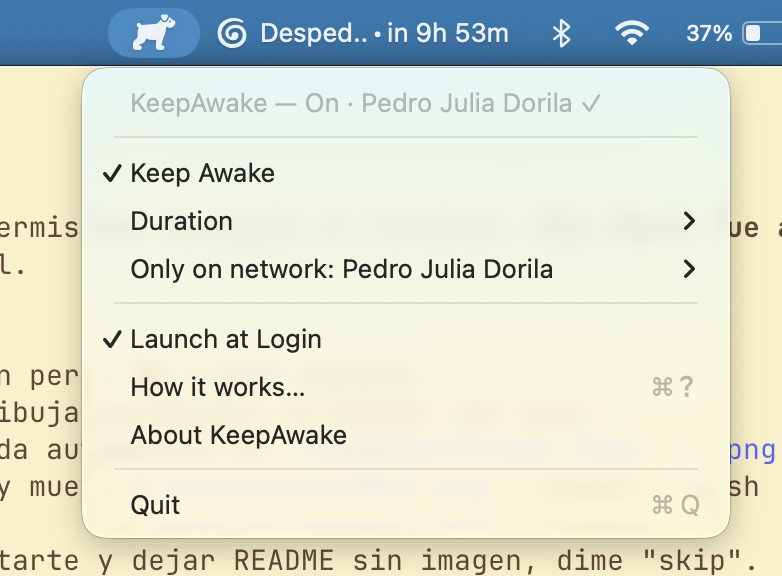

[Versión en español](README.es.md)

# KeepAwake

> Open-source macOS menubar app that prevents idle sleep on Apple Silicon, with optional Wi-Fi (SSID) gating. A lightweight, MIT-licensed alternative to Amphetamine, Caffeine, KeepingYouAwake, Theine, Lungo, and the `caffeinate` CLI.




## What is KeepAwake?

**KeepAwake** is a tiny Swift + AppKit menubar utility for macOS that stops your MacBook Pro, MacBook Air, Mac mini, or Mac Studio from going to idle sleep. It is written for Apple Silicon (M1, M2, M3, M4) and supports macOS Sonoma (14), macOS Sequoia (15), and macOS 16+. It uses Apple's official `IOPMAssertion` API — the same primitive behind the built-in `caffeinate` command — wrapped in a one-click menubar icon. Its differentiating feature is **Wi-Fi gating**: KeepAwake can be configured to only keep the Mac awake when connected to a specific Wi-Fi network (SSID), such as your iPhone hotspot, your home network, or a tethered Android device. It is open source under the MIT license, has zero third-party dependencies, no telemetry, no network calls, no account, and weighs about 20 MB of RAM at 0% idle CPU.

If you're searching for "how to keep my Mac awake on battery", "caffeinate with Wi-Fi gating", "menubar app to prevent idle sleep on MacBook", "open source alternative to Amphetamine", or "keep MacBook awake while running Claude Code overnight" — KeepAwake is built for exactly those use cases.

## Use cases

### Running Claude Code or AI coding agents overnight
Long-running LLM-driven agents (Claude Code, Cursor background agents, Aider, OpenDevin, Continue.dev) need the Mac to stay awake while they iterate. KeepAwake holds an idle-sleep assertion for the entire session.

### Long Xcode, SwiftPM, Bazel, or CI builds
Compile cycles for large iOS/macOS projects or monorepos can run 30+ minutes. Prevent the screen from locking and the system from sleeping mid-build.

### Large downloads and dataset / model-weight transfers
Pulling a 70B model from Hugging Face, syncing a dataset to a local volume, or downloading Xcode betas. Pair Wi-Fi gating with your home network so it auto-pauses if you leave.

### Zoom, Google Meet, FaceTime, and Microsoft Teams calls
Some conferencing apps don't reliably prevent idle sleep on macOS. KeepAwake guarantees the system stays awake for the call.

### Local LLM inference and ML training
Running Ollama, LM Studio, llama.cpp, MLX, PyTorch, or fine-tuning on Apple Silicon GPUs — keep the box up while a job runs.

### Music, podcast, or radio playback
Continuous audio over AirPlay or Bluetooth without the system napping.

### Anything you want running on a known network only
Backups, sync jobs, or work tasks that should only progress on a trusted SSID (e.g. your hotspot, never on coffee-shop Wi-Fi).

---

> ## Important limitation — read before installing
>
> **KeepAwake does NOT keep your Mac awake with the lid closed on battery.**
>
> On Apple Silicon, lid-closed-on-battery sleep is enforced by firmware below the kernel. No software — not KeepAwake, not `caffeinate`, not Amphetamine, not KeepingYouAwake, not Theine — can bypass it. KeepAwake only helps with **lid-open** scenarios (or lid-closed while plugged into power with an external display attached, the "clamshell mode" that macOS already supports).
>
> If you need code to run while your Mac is closed on battery, use a remote dev box and SSH from your phone.

---

## Features

- One-click toggle in the menubar (cup-and-saucer icon, fills when active).
- Duration presets: 15 minutes, 1 hour, 2 hours, 5 hours, indefinite, or "until lid closes".
- Optional **Wi-Fi SSID gating**: only keep awake when connected to a chosen network, with a 60-second grace period on network changes.
- Launch at Login toggle (via `SMAppService`).
- Auto-off system notification when a timed session ends.
- ~20 MB RAM, 0% CPU when idle. Zero third-party dependencies.
- Ad-hoc signed, runs entirely locally. **No telemetry, no analytics, no network calls, no account.**
- Source code: 100% Swift, built directly with `swiftc` (no Xcode project required).

## How KeepAwake compares

KeepAwake's niche is **Wi-Fi gating + open source + tiny**. Other apps in this space are excellent — pick whichever fits your needs.

| App | Open source | Wi-Fi (SSID) gating | Lid-close aware | Free | No telemetry | Dependencies |
| --- | --- | --- | --- | --- | --- | --- |
| **KeepAwake** | Yes (MIT) | **Yes** | Yes | Yes | Yes | None |
| Amphetamine | No | No | Yes | Yes (App Store) | Unclear | App Store |
| Caffeine (classic) | No | No | No | Yes | Unclear | None |
| KeepingYouAwake | Yes (MIT) | No | Yes | Yes | Yes | None |
| Theine | No | No | No | Yes (App Store) | Unclear | App Store |
| Lungo | No | No | No | Paid | Unclear | App Store |
| `caffeinate` (CLI) | Bundled with macOS | No | Partial (`-i`, `-d`, etc.) | Yes | Yes | None |

If you don't need Wi-Fi gating and just want a free, open-source idle-sleep blocker, [KeepingYouAwake](https://github.com/newmarcel/KeepingYouAwake) is a great alternative. KeepAwake exists specifically for the "only stay awake on my hotspot / home Wi-Fi" workflow.

## Install

### Option 1 — Pre-built (from Releases)

1. Download `KeepAwake.zip` from the [Releases](../../releases) page and unzip it.
2. Strip the quarantine attribute (the build is ad-hoc signed, not notarized):
   ```bash
   xattr -d com.apple.quarantine KeepAwake.app
   ```
3. Move it into your Applications folder:
   ```bash
   mv KeepAwake.app ~/Applications/
   open ~/Applications/KeepAwake.app
   ```

### Option 2 — From source

```bash
git clone https://github.com/fbahamonde/keepawake.git
cd keepawake
./build.sh
cp -R KeepAwake.app ~/Applications/
open ~/Applications/KeepAwake.app
```

**Requirements:** macOS 14 (Sonoma) or later on Apple Silicon (M1 / M2 / M3 / M4), Xcode Command Line Tools (`xcode-select --install`). Intel Macs are not supported.

## Usage

- **Left-click** the menubar icon to toggle Keep Awake on/off. Filled icon = on.
- **Right-click** to open the menu.

### Duration

Pick how long the session should last:

- `15 minutes` / `1 hour` / `2 hours` / `5 hours` — auto-off when the timer expires, with a notification.
- `Indefinitely` — stays on until you turn it off.
- `Until lid closes` — turns off when you close the lid.

### Wi-Fi gating (the differentiator)

Optional. Only keep awake when connected to a specific Wi-Fi network — for example your iPhone hotspot, Android tethering, or your home router's SSID.

1. Connect to the Wi-Fi you want as the target (for example, your phone's hotspot).
2. Menu → `Only on network` → `Set current Wi-Fi as target`.
3. If you switch networks, KeepAwake gives you a 60-second grace period (icon shows an orange badge with a countdown). If you don't reconnect, the assertion is released and the menu shows `Paused · waiting for <target>`.
4. Reconnecting to the target SSID re-acquires the assertion automatically.

With no target set, KeepAwake works everywhere without checking the network.

### Icon states

| Icon | Meaning |
| --- | --- |
| Outline | Off |
| Filled | On, network OK (or no target set) |
| Filled + orange badge | On, wrong network, 60-second countdown |
| Outline + grey | Paused, waiting to return to target network |

## FAQ

### Does KeepAwake work with the lid closed on battery?
No. On Apple Silicon Macs, lid-closed sleep on battery is enforced by firmware, below the operating system. No app can override it — not Amphetamine, not `caffeinate`, not KeepAwake. The only way to keep a Mac running with the lid closed is clamshell mode: plugged into power, with an external display attached. If you need to run jobs with the lid shut on battery, use a remote machine and SSH in.

### How is KeepAwake different from the built-in `caffeinate` command?
`caffeinate` is a CLI you have to remember to run (`caffeinate -di`) and stop. KeepAwake gives you a persistent menubar toggle, duration presets, Launch at Login, and — most importantly — **Wi-Fi SSID gating**, which `caffeinate` does not offer. Under the hood both use the same `IOPMAssertion` API.

### How is KeepAwake different from Amphetamine?
Amphetamine is a polished, feature-rich App Store app. KeepAwake is much smaller in scope: it does one thing (idle-sleep prevention) plus Wi-Fi gating. KeepAwake is **open source (MIT)**, has **no telemetry**, is distributed outside the App Store, and is roughly a few thousand lines of Swift you can read in an afternoon. Pick KeepAwake if you want auditability and Wi-Fi gating; pick Amphetamine if you want trigger automation and a deeper feature set.

### How is KeepAwake different from KeepingYouAwake?
KeepingYouAwake is the closest analog — also open source, also MIT, also menubar-only. The main difference is **Wi-Fi gating**: KeepAwake will automatically pause when you leave a target SSID and resume when you return. KeepingYouAwake does not.

### Why does KeepAwake ask for Location permission?
macOS classifies the Wi-Fi SSID as sensitive data — knowing your network name can reveal where you are. Apps can only read the SSID with "Location When In Use" permission granted. KeepAwake uses it **only** to compare the current SSID against your configured target. Without Location permission, basic Keep Awake still works; only the Wi-Fi gating feature is disabled. The app never records your location and the SSID never leaves your machine.

### Does this work on Intel Macs?
No. KeepAwake is Apple Silicon only (M1, M2, M3, M4). If there's enough interest, an Intel build is straightforward to add — open an issue.

### Does this work on macOS Ventura / Sonoma / Sequoia?
macOS 14 (Sonoma), macOS 15 (Sequoia), and macOS 16+ are supported. macOS 13 (Ventura) and earlier are not tested.

### Can I use this with Claude Code, Cursor, or AI coding agents?
Yes — this is one of the main reasons it exists. Set a duration (or "Indefinitely") and KeepAwake will hold the idle-sleep assertion while your agent runs.

### Can I use it with my iPhone hotspot or Android tethering?
Yes. Connect to the hotspot, then in the KeepAwake menu choose `Only on network` → `Set current Wi-Fi as target`. KeepAwake will only keep the Mac awake on that specific SSID and pause cleanly when you leave.

### Does it send any data anywhere?
No. KeepAwake makes zero network calls. There is no telemetry, no analytics, no update check, no crash reporter, no account. Everything runs locally. You can verify this by reading the source (`src/`) — it's a few files of Swift with no networking imports.

### Is it sandboxed? Is it in the App Store?
No. KeepAwake is distributed as an ad-hoc signed `.app` outside the App Store. It is not sandboxed. This is a deliberate choice — distributing outside the App Store means no annual developer fee and no review cycle, which keeps the project free and the source unmodified.

### How do I uninstall?
Drag `KeepAwake.app` from `~/Applications` to the Trash. Optionally remove the preferences file:
```bash
defaults delete com.felipe.keepawake
```

## Architecture

KeepAwake is intentionally small. The main building blocks:

- **`IOPMAssertionCreateWithName`** with type `PreventUserIdleSystemSleep` — the actual idle-sleep prevention mechanism. Same primitive used by `caffeinate` and every other "stay awake" app on macOS.
- **CoreWLAN + CoreLocation** — read the current Wi-Fi SSID for gating.
- **AppKit** — `NSStatusItem`, menu, status-bar icon. `LSUIElement = true` keeps the app out of the Dock and `Cmd-Tab`.
- **ServiceManagement** — `SMAppService` for the Launch at Login toggle.
- **UserNotifications** — "session ended" notification when a timer expires.

No third-party dependencies. Built with `swiftc` directly (no Xcode project), ad-hoc signed (`codesign -s -`).

Bundle ID: `com.felipe.keepawake`.

## Development

```bash
swift test       # 38 XCTest cases
./build.sh       # build KeepAwake.app
```

File layout:

```
src/                Swift sources (AppDelegate, status item, assertion controller, Wi-Fi monitor, ...)
tests/              XCTest target (KeepAwakeTests)
Info.plist          Bundle metadata, LSUIElement, location usage description
build.sh            swiftc + codesign --force --deep -s -
Package.swift       SwiftPM manifest, used for `swift test` only
SMOKE_TEST.md       Hand-run checklist before declaring a build good
```

## Contributing

This is a personal tool, but issues and PRs are welcome. If you find a bug, the easiest fix is usually a focused PR with a regression test in `tests/`. Please keep the dependency footprint at zero.

## Author

Built by **Felipe Bahamonde** — contact: `bahamondefelipem@gmail.com`. Issues and pull requests on [GitHub](https://github.com/fbahamonde/keepawake) are the preferred channel.

## License

[MIT](LICENSE) © 2026 Felipe Bahamonde. Personal tool, no warranty.
